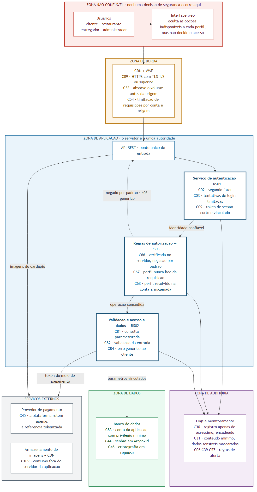

# Etapa 3 — Arquitetura Segura

Esta etapa visa transformar os riscos e controles definidos na [Etapa 2 — Avaliação e Tratamento de Riscos](./etapa-2-riscos-nist.md) em requisitos de segurança e decisões de arquitetura.

---

## Sumário

1. [Requisitos de Segurança](#1-requisitos-de-segurança)
2. [Diagrama da Arquitetura Segura](#2-diagrama-da-arquitetura-segura)
3. [Decisões de Arquitetura](#3-decisões-de-arquitetura)
4. [Considerações Finais](#4-considerações-finais)
5. [Distribuição Integrante X Responsabilidades](#5-distribuição-integrante-x-responsabilidades)

---

## 1. Requisitos de Segurança

| ID | Ameaça de Origem | Risco de origem | Requisito de segurança | Critério de verificação
|---|---|---|---|---
| [RS01](#rs01--proteção-contra-tentativas-automatizadas-de-autenticação) | S01 | R01 | O Bah Delivery deve limitar tentativas repetidas de autenticação e aplicar mecanismos adicionais de verificação de identidade quando forem detectadas tentativas suspeitas | O requisito será atendido quando tentativas excessivas de autenticação forem limitadas e acessos considerados suspeitos exigirem verificação adicional antes de serem autorizados
| [RS02](#rs02--proteção-contra-injeção-de-comandos-sql) | T05 | R13 | Utilizar consultas parametrizadas e validar as entradas dos usuários conforme o formato esperado, impedindo que dados fornecidos alterem a estrutura das consultas SQL | O requisito será atendido quando entradas maliciosas não alterarem as consultas SQL e entradas inválidas forem rejeitadas antes do processamento
| [RS03](#rs03--controle-de-autorização-decidido-no-servidor) | E01, E02, E03 | R11 | Verificar a autorização no servidor em toda rota administrativa, negando o acesso por padrão, e resolver o perfil do usuário no próprio servidor, sem aceitá-lo como campo da requisição nem confiar em token com assinatura não verificada | O requisito será atendido quando rotas administrativas invocadas por conta sem privilégio forem recusadas, o campo de perfil enviado na requisição for ignorado e tokens com assinatura inválida ou algoritmo alterado forem rejeitados

---

### RS01 — Proteção contra tentativas automatizadas de autenticação
**Risco relacionado:** R01 — Comprometimento da conta de um cliente por obtenção indevida de suas credenciais.

**Justificativa:** A ameaça S01 considera que um atacante pode utilizar credenciais obtidas
em vazamentos de outros serviços para realizar tentativas de autenticação
em massa contra contas de clientes (*credential stuffing*). Sem mecanismos que dificultem tentativas automatizadas de autenticação, credenciais reutilizadas podem resultar no comprometimento de contas legítimas. Isso pode permitir acesso ao histórico de pedidos, endereços residenciais e outras informações associadas ao cliente, além da realização de pedidos fraudulentos em nome da vítima.

### RS02 — Proteção contra injeção de comandos SQL
**Risco relacionado:** R13 — Comprometimento da integridade do banco de dados por injeção de comandos nas consultas da aplicação.

**Justificativa:** A ameaça T05 considera que campos de busca de restaurantes e produtos podem receber entradas controladas pelo usuário. Caso esses valores sejam concatenados diretamente às consultas SQL, um atacante poderá inserir elementos capazes de modificar a consulta originalmente definida pela aplicação. A exploração dessa vulnerabilidade pode permitir leitura, alteração ou exclusão indevida de informações armazenadas no banco de dados, comprometendo pedidos, cardápios, avaliações e outros dados utilizados pelo Bah Delivery. Como o banco de dados constitui um ativo crítico da plataforma, o risco R13 foi classificado como crítico e deve ser tratado por meio da separação entre os comandos SQL definidos pela aplicação e os valores fornecidos externamente.

### RS03 — Controle de autorização decidido no servidor
**Risco relacionado:** R11 — Obtenção indevida de privilégios administrativos.

**Justificativa:** As ameaças E01, E02 e E03 compartilham a mesma condição: a autorização é decidida fora do servidor. Em E01, a restrição existe apenas na interface, e os endpoints de gerenciamento de usuários e de restaurantes não verificam o papel do usuário autenticado. Em E02, o perfil é recebido como campo da requisição e gravado sem validação, permitindo que o atacante se declare administrador. Em E03, o token de sessão carrega o perfil e é aceito sem verificação adequada da assinatura, o que possibilita forjar um token administrativo. Por isso R11 foi classificado como crítico e ocupa a segunda prioridade do registro, já que habilita outros riscos críticos, como R07 e R12. O tratamento exige que o servidor seja a única autoridade sobre a autorização.

---

### 1.2. Vulnerabilidade Catalogada Correspondente

| Risco | Vulnerabilidade ou categoria | Referência utilizada | Relação com o sistema
|---|---|---|---|
| R01 | Improper Restriction of Excessive Authentication Attempts | CWE-307 | Essa fraqueza está relacionada ao cenário identificado em S01, pois a ausência de limitação permite que um atacante realize um grande número de tentativas de login utilizando credenciais obtidas anteriormente
| R13 | Neutralização inadequada de elementos especiais usados ​​em um comando SQL ('Injeção de SQL') | CWE-89 | Essa fraqueza corresponde diretamente ao cenário identificado em T05 e R13, pois uma entrada fornecida nos campos de busca poderia alterar a consulta caso fosse concatenada diretamente ao comando SQL
| R11 | Missing Authorization da categoria Broken Access Control | CWE-862 | Essa fraqueza corresponde ao cenário identificado em E01 e R11, pois as rotas administrativas executam a operação sem verificar o papel do usuário autenticado, confiando na ocultação feita pela interface. As demais variantes do requisito têm fraquezas próprias no catálogo: CWE-915 para o perfil gravado a partir da requisição (E02) e CWE-347 para o token aceito sem verificação da assinatura (E03)

---

## 2. Diagrama da Arquitetura Segura

O diagrama apresenta os componentes do Bah Delivery organizados por **zonas de confiança**, e não por camadas funcionais. A escolha é deliberada: o que interessa a esta etapa não é como o sistema se divide para funcionar, e sim onde ele deixa de confiar em quem envia a requisição e passa a decidir por conta própria.

Cada componente indica os controles do plano de tratamento da [Etapa 2](./etapa-2-riscos-nist.md#352-planos-por-risco) que nele se materializam, de modo que o diagrama não introduz medidas novas: ele mostra em que ponto da arquitetura as medidas já aprovadas passam a existir.



**Arquivo-fonte:** [`diagramas/etapa-3/arquitetura-segura.mmd`](../diagramas/etapa-3/arquitetura-segura.mmd) — escrito em Mermaid e versionado junto da imagem. Para regerar o PNG após qualquer alteração do fonte:

```bash
npx @mermaid-js/mermaid-cli -i arquitetura-segura.mmd -o arquitetura-segura.png -w 1800 -b white
```

### 2.1. Zonas de Confiança

| Zona | Componentes | Premissa adotada | Condição da travessia |
|---|---|---|---|
| **Não confiável** | Usuários e interface web | Nada que venha desta zona é confiável, inclusive o que é enviado por um usuário autenticado. A interface oculta as opções indisponíveis a cada perfil, mas essa ocultação é conveniência de uso, e não controle de acesso | Somente por HTTPS com TLS 1.2 ou superior (C89) |
| **Borda** | CDN com WAF | O tráfego abusivo deve ser absorvido antes de alcançar o servidor da aplicação: volume é problema de infraestrutura, não da regra de negócio | Requisição já filtrada quanto a volume e origem (C53, C54) |
| **Aplicação** | API REST, serviço de autenticação, regras de autorização, validação e acesso a dados | O servidor é a única autoridade sobre identidade e permissão. Tudo que não estiver explicitamente permitido é negado | Identidade resolvida no servidor e operação aprovada pelas regras de autorização (C66, C68) |
| **Dados** | Banco de dados | Não é alcançável diretamente pela internet e recebe apenas comandos originados na zona de aplicação | Consulta parametrizada executada por conta de privilégio mínimo (C81, C83) |
| **Auditoria** | Logs e monitoramento | O registro precisa sobreviver a quem tem poder sobre a aplicação, inclusive ao próprio administrador | Gravação unidirecional: a aplicação acrescenta e não altera nem exclui (C30, C31) |
| **Serviços externos** | Provedor de pagamento e armazenamento de imagens com CDN | O dado que a plataforma não guarda é o dado que ela não pode vazar | Apenas a referência tokenizada do meio de pagamento e as imagens já validadas (C45, C109) |

### 2.2. Realização dos Requisitos da Seção 1

| Requisito | Risco de origem | Componente que o realiza | Controles posicionados no diagrama | Ameaça contida |
|---|---|---|---|---|
| [RS01](#rs01--proteção-contra-tentativas-automatizadas-de-autenticação) | R01 | Serviço de autenticação | C02, C03, C09 | S01 — tentativas automatizadas de autenticação com credenciais vazadas |
| [RS02](#rs02--proteção-contra-injeção-de-comandos-sql) | R13 | Validação e acesso a dados | C81, C82, C84 | T05 e I06 — injeção de comandos e exposição por mensagem de erro |
| [RS03](#rs03--controle-de-autorização-decidido-no-servidor) | R11 | Regras de autorização | C66, C67, C68 | E01, E02 e E03 — autorização decidida fora do servidor |

### 2.3. Leitura do Diagrama

Três propriedades da arquitetura ficam visíveis na figura e sustentam os requisitos acima.

**A autorização é um ponto único, e não uma verificação espalhada.** Toda requisição atravessa a autenticação e, em seguida, as regras de autorização, antes de qualquer leitura ou escrita. A seta tracejada de retorno à API representa a negação por padrão de C66: quando a operação não consta das permissões do perfil, a requisição termina ali, com resposta genérica. Como o perfil é resolvido na conta armazenada (C68) e nunca lido da requisição (C67), as três variantes de E01, E02 e E03 são recusadas no mesmo lugar. É também o que separa a interface, que apenas oculta opções, do servidor, que decide.

**A zona de dados não é alcançável a partir da internet.** Não existe seta que vá da zona não confiável ao banco de dados: o único caminho passa pela borda, pela API, pela autorização e pela validação. Assim, a consulta parametrizada de C81 deixa de ser uma boa prática pontual e passa a ser a única forma de a entrada do usuário alcançar o banco, o que é a condição para afirmar, como faz a estratégia *evitar* adotada em R13, que a exposição foi eliminada.

**O registro de auditoria está fora do alcance de quem opera a aplicação.** Os três componentes da zona de aplicação escrevem no registro, mas o armazenamento está em zona própria e a gravação é unidirecional. Essa separação é o que impede a supressão de evidências descrita em RP04, e é a razão de R12 depender de C30 e não apenas de C31: registrar bem não basta se quem é auditado pode apagar o registro.

As decisões de arquitetura que decorrem dessas propriedades, com o respectivo problema tratado, motivo, componente afetado e resultado esperado, são registradas na seção seguinte.

---

## 3. Decisões de Arquitetura

As decisões abaixo registram como o Bah Delivery seria organizado para atender aos requisitos desta etapa. Cada uma indica o risco tratado, a decisão, o motivo, o componente afetado no diagrama da seção 2 e o resultado esperado, e referencia os controles definidos no [plano de tratamento da Etapa 2](./etapa-2-riscos-nist.md#352-planos-por-risco), de modo que a arquitetura não introduza medidas novas sem relação com o plano já aprovado.

### 3.1. Resumo

| ID | Decisão | Risco tratado | Requisito | Controles relacionados |
|---|---|---|---|---|
| DA01 | Concentrar autenticação, segundo fator e limitação de tentativas em um único serviço de autenticação, com limitação progressiva em vez de bloqueio permanente | R01 (e R10) | RS01 | C01, C02, C03, C06 |
| DA02 | Restringir todo acesso ao banco a uma camada de acesso a dados que expõe apenas consultas parametrizadas, com a proibição de concatenação imposta pelo pipeline | R13 (e I06) | RS02 | C79, C80, C81, C82, C83, C84 |
| DA03 | Concentrar a autorização em um ponto único de decisão no servidor, com negação por padrão, papel resolvido na conta armazenada e verificação de propriedade do recurso além do papel | R11 (e R16) | RS03 | C66, C67, C68, C69, C100, C101 |

---

### 3.2. DA01 - Autenticação, segundo fator e limitação de tentativas em um serviço único

**Problema ou risco tratado.** R01, classificado como crítico, derivado da ameaça S01: um atacante utiliza credenciais obtidas em vazamentos de outros serviços para tentar autenticar-se em massa contra contas de clientes. O requisito RS01 exige limitar tentativas repetidas e aplicar verificação adicional de identidade quando o acesso for considerado suspeito.

**Decisão tomada.** A validação de credenciais, a emissão de sessão, o segundo fator e a contagem de tentativas ficam concentrados em um serviço de autenticação próprio, posicionado atrás da borda. Nenhum outro componente valida credenciais nem emite sessão. A limitação de tentativas é progressiva, aplicada simultaneamente por conta e por origem da requisição, com atraso incremental e desafio adicional após o limiar, sem bloqueio permanente acionado apenas pela contagem por conta. O segundo fator é obrigatório para os perfis administrador e restaurante e exigido do cliente quando o acesso parte de dispositivo não reconhecido.

**Motivo.** Três razões sustentam a decisão:

1. Se cada rota que consome credenciais mantivesse sua própria contagem, o limiar seria contornável pela simples alternância entre rotas, e a limitação exigida por RS01 deixaria de ser verificável em um ponto único.
2. O bloqueio permanente por contagem de falhas converteria o controle de R01 em vetor da condição D06, na qual o mecanismo de proteção passa a ser usado para indisponibilizar contas alheias. Essa é a ressalva já registrada em C03 e reaproveitada no tratamento de R10, e ela é o que justifica a escolha por atraso e desafio em lugar de bloqueio.
3. Exigir o segundo fator do cliente apenas em dispositivo novo mantém o atrito em nível aceitável para o perfil de maior volume, decisão que cabe ao Produto conforme a política de C01, enquanto os perfis administrador e restaurante, cujo comprometimento tem consequência maior, não recebem essa exceção.

**Componente afetado.** Serviço de autenticação, que passa a ser o único detentor da lógica de credenciais e do segundo fator; borda, responsável pela contagem por origem antes que a requisição alcance a aplicação; interface web, que deixa de decidir sobre o acesso e apenas apresenta o desafio devolvido pelo serviço; e o armazenamento dos dispositivos reconhecidos por cliente, necessário para distinguir o acesso habitual do novo.

**Resultado esperado.** Tentativas sucessivas contra a mesma conta passam a sofrer atraso crescente e a exigir desafio, tornando o custo de uma campanha automatizada desproporcional ao ganho, e o acesso a partir de dispositivo não reconhecido não se completa apenas com usuário e senha. O critério de verificação de RS01 é observável em um só componente, e a conta permanece acessível a partir da origem legítima mesmo durante uma tentativa em curso, o que preserva a decisão tomada em R10.

---

### 3.3. DA02 - Acesso ao banco restrito a uma camada com consultas parametrizadas

**Problema ou risco tratado.** R13, classificado como crítico e o único do registro com estratégia Evitar, derivado das ameaças T05 (injeção de comandos SQL nos campos de busca de restaurantes e produtos) e I06 (exposição de informações internas por mensagens de erro detalhadas). O requisito RS02 exige o uso de consultas parametrizadas e a validação das entradas conforme o formato esperado.

**Decisão tomada.** Nenhum componente da aplicação monta comandos SQL por concatenação. O acesso ao banco de dados fica restrito a uma camada de acesso a dados que expõe exclusivamente consultas com vinculação de parâmetros, e a proibição de concatenar entrada do usuário é imposta por regra de análise estática no pipeline, que bloqueia a integração do código que a violar. A aplicação conecta ao banco com conta de privilégio mínimo, sem permissão de alteração de estrutura nem de acesso a tabelas fora do seu escopo, e as mensagens de erro devolvidas ao cliente são genéricas, ficando o rastreamento da exceção e a consulta executada apenas no registro interno.

**Motivo.** A validação de entrada, isoladamente, funciona como uma lista de bloqueio implícita e falha diante de codificações alternativas do mesmo conteúdo. A vinculação de parâmetros resolve o problema em outro nível, ao separar a estrutura da consulta do dado fornecido, e por isso é adotada como proteção principal (C81), com a validação por lista de caracteres permitidos mantida como defesa adicional (C82), e não como substituta. Concentrar as consultas em uma camada única torna o inventário de C80 viável e mantém finito o conjunto de pontos a auditar. A regra no pipeline é o que sustenta a estratégia Evitar ao longo do tempo: sem ela, código escrito depois da correção reintroduziria a condição, e a eliminação do risco deixaria de ser verdadeira. O privilégio mínimo e a mensagem genérica não impedem a injeção, mas limitam o que uma falha remanescente alcançaria e removem a realimentação que torna a exploração barata, que é exatamente a condição descrita em I06.

**Componente afetado.** Camada de acesso a dados da API REST, que passa a ser o único caminho até o banco; pipeline de integração, que recebe a regra de análise estática; banco de dados, cuja conta de aplicação tem os privilégios reduzidos; e o tratamento de erros da API, que separa a resposta ao cliente do detalhe registrado internamente.

**Resultado esperado.** Entradas maliciosas nos campos de busca passam a ser tratadas como dado da consulta, sem alterar sua estrutura, e entradas fora do formato esperado são recusadas antes do processamento, que são os dois critérios de verificação de RS02. A ausência de ocorrências em nova execução da análise estática, prevista como evidência de C81, torna possível afirmar que a condição de origem foi removida, e não apenas mitigada, o que é o que a estratégia Evitar exige.

---

### 3.4. DA03 - Autorização como ponto único de decisão no servidor, com negação por padrão

**Problema ou risco tratado.** R11, classificado como crítico e segundo em prioridade no registro, derivado das ameaças E01, E02 e E03. As três descrevem a mesma condição por caminhos diferentes: a autorização é decidida fora do servidor. Em E01 a restrição existe apenas na interface e as rotas de gerenciamento não verificam o papel; em E02 o perfil chega como campo da requisição e é gravado sem validação; em E03 o token carrega o perfil e é aceito sem verificação adequada da assinatura. O requisito RS03 exige que o servidor seja a única autoridade sobre a autorização. A decisão trata também R16 na parte em que o papel correto não basta, porque um perfil legítimo pode alcançar registro de outro titular.

**Decisão tomada.** A autorização passa a ser um ponto único de decisão, atravessado por toda requisição depois da autenticação e antes de qualquer leitura ou escrita, e nenhuma rota decide por conta própria. A política é declarada como matriz de perfil por operação (**C100**), lida pela função de autorização, de modo que a permissão é dado versionado e não código espalhado. A negação é o padrão: operação não declarada na matriz é recusada, e uma rota nova nasce inacessível até que sua entrada exista (**C66**). O papel usado na decisão é resolvido no repositório de contas a cada requisição, nunca lido do token nem aceito como campo do corpo (**C67**, **C68**), e o token é verificado com segredo mantido em gerenciador e algoritmo fixado no servidor. Além do papel, a decisão verifica que o recurso pertence a quem o solicita (**C101**). Alteração de permissões exige nova autenticação e gera registro de auditoria (**C69**). A interface web continua ocultando as opções indisponíveis, mas essa ocultação é conveniência de uso, e não controle de acesso.

**Motivo.** Quatro razões sustentam a decisão:

1. Verificação espalhada por rota não é verificável. Se cada endpoint repetir a checagem, a pergunta "quais operações o perfil restaurante pode executar" só é respondida lendo o código inteiro, e a rota escrita amanhã fica exposta por esquecimento, e não por decisão. Com a matriz e a negação por padrão, o esquecimento produz recusa, que é o modo seguro de falhar.
2. O papel lido do token é dado transportado pelo cliente. A assinatura prova a origem do token, mas não sua atualidade: um privilégio revogado continuaria válido até a expiração, e a revogação em cadeia prevista em C71 não teria efeito imediato. Resolver o papel na conta armazenada a cada requisição é o que torna a revogação instantânea e recusa o token forjado descrito em E03.
3. Aceitar o perfil como campo da requisição transforma o cadastro em concessão de privilégio, que é exatamente E02 e a fraqueza CWE-915. Copiar apenas os campos declarados e fixar o perfil de menor privilégio elimina a condição, em vez de filtrá-la.
4. O papel correto não delimita o escopo. Um estabelecimento legítimo que altera o produto de outro atravessa qualquer verificação de papel, porque ele de fato é um restaurante. É a razão de a decisão incluir C101, e é o ponto em que R11 encosta em R16 e em R07: sem a verificação de propriedade, a autorização responde "quem é você" e deixa sem resposta "isto é seu".

**Componente afetado.** Regras de autorização, que passam a ser o ponto único de decisão da zona de aplicação e o detentor da matriz de permissões; serviço de autenticação, que emite sessão sem embutir papel na decisão; repositório de contas, consultado a cada requisição para resolver o papel vigente; API REST, cujas rotas passam a declarar a operação que executam em vez de verificar permissão por conta própria; interface web, que deixa de ser ponto de restrição; e zona de auditoria, que recebe as recusas e toda alteração de permissão.

**Resultado esperado.** Os três critérios de verificação de RS03 tornam-se observáveis em um só componente: a rota administrativa invocada por conta de cliente é recusada, o campo de perfil enviado na requisição não produz efeito e o token com assinatura inválida ou algoritmo alterado é rejeitado antes de qualquer verificação de permissão. A implementação e os testes correspondentes estão na [prática 2 da Etapa 4](./etapa-4-codigo-seguro-e-testes-seguranca.md#2-prática-2-autorização-no-servidor), exercitada por TS03 e TS04. Como efeito secundário, toda recusa passa a ser registrada com rota, perfil resolvido e recurso solicitado, o que produz o evento previsto na [Etapa 6](../roteiros/etapa-6-deteccao-de-intrusoes.md#33-relação-dos-eventos) e permite distinguir a recusa isolada, que é o sistema funcionando, da sequência de recusas contra rotas administrativas, que é tentativa de elevação em curso.

---

## 4. Considerações Finais

A etapa converte os riscos da [Etapa 2](./etapa-2-riscos-nist.md) em três requisitos verificáveis, um diagrama por zonas de confiança e três decisões de arquitetura. O que a mantém coerente é a cadeia de identificadores: cada requisito nasce de uma ameaça da Etapa 1 e de um risco do registro, cada decisão referencia os controles já aprovados no plano de tratamento, e nenhuma medida nova foi introduzida aqui.

| Requisito | Risco | Ameaças | Vulnerabilidade catalogada | Decisão | Componente do diagrama | Implementação na Etapa 4 |
|---|---|---|---|---|---|---|
| RS01 | R01 | S01 | CWE-307 | DA01 | Serviço de autenticação | — |
| RS02 | R13 | T05, I06 | CWE-89 | DA02 | Validação e acesso a dados | Prática 1 (TS01, TS02) |
| RS03 | R11 (e R16) | E01, E02, E03 | CWE-862, CWE-915, CWE-347 | DA03 | Regras de autorização | Prática 2 (TS03, TS04) |

Três observações fecham a etapa.

**As zonas de confiança foram escolhidas no lugar das camadas funcionais.** A divisão por camadas descreveria como o sistema funciona; a divisão por zonas descreve onde ele deixa de confiar em quem envia a requisição. É por isso que a interface web aparece na zona não confiável junto do usuário, ainda que seja software da própria plataforma: o que ela oculta é conveniência, e a decisão acontece depois da travessia.

**As três decisões repetem um mesmo padrão.** Em DA01, DA02 e DA03 a medida é concentrar em um ponto único aquilo que estava distribuído — a autenticação em um serviço, o acesso ao banco em uma camada, a autorização em uma função. O motivo é o mesmo nos três casos: uma propriedade de segurança só é verificável quando existe um lugar onde ela pode ser observada, e só é sustentável quando o esquecimento produz recusa em vez de exposição.

**A arquitetura é projeto, e não implantação.** O Bah Delivery não está implementado. O diagrama e as decisões descrevem como a plataforma seria organizada para atender aos requisitos, e a verificação de cada critério depende das evidências previstas nos controles da Etapa 2. A [Etapa 4](./etapa-4-codigo-seguro-e-testes-seguranca.md) leva duas dessas decisões ao código, com os testes escritos antes da implementação, e é o ponto em que os critérios de RS02 e RS03 deixam de ser afirmação e passam a ser teste executável.

---

## 5. Distribuição Integrante X Responsabilidades

| Integrante | Responsabilidades |
|------------|-------------------|
| Arthur Medeiros | Definir requisito de segurança e sua respectiva vulnerabilidade catalogada. |
| Emanuel Ferreira | Definir a decisão de arquitetura DA03 e consolidar a etapa. |
| Guilherme Mundt | Modelar diagrama de arquitetura segura. |
| Lívia Barbosa | Definir requisito de segurança e sua respectiva vulnerabilidade catalogada. |
| Mariana Padilha | Definir requisito de segurança e sua respectiva vulnerabilidade catalogada. |
| Matheus Ciocca | Definir as decisões de arquitetura DA01 e DA02. |
| Matheus Ciocca | Definir decisões de arquitetura. |